<p align="center">
  
</p>

<p align="center">
  <a href="https://github.com/lvxro/rvt-vortex/releases/latest"></a>
  <a href="https://github.com/lvxro/rvt-vortex/actions/workflows/ci.yml"></a>
  
  
  
  
  <a href="LICENSE"></a>
</p>

<p align="center">
  <a href="https://github.com/lvxro/rvt-vortex/releases/latest"></a>
  <a href="#install-in-two-minutes"></a>
  <a href="#a-tour-of-the-interface"></a>
  <a href="#rvt-vortex-vs-revitcortex"></a>
  <a href="docs/AUTOPILOT.md"></a>
</p>

<p align="center">
  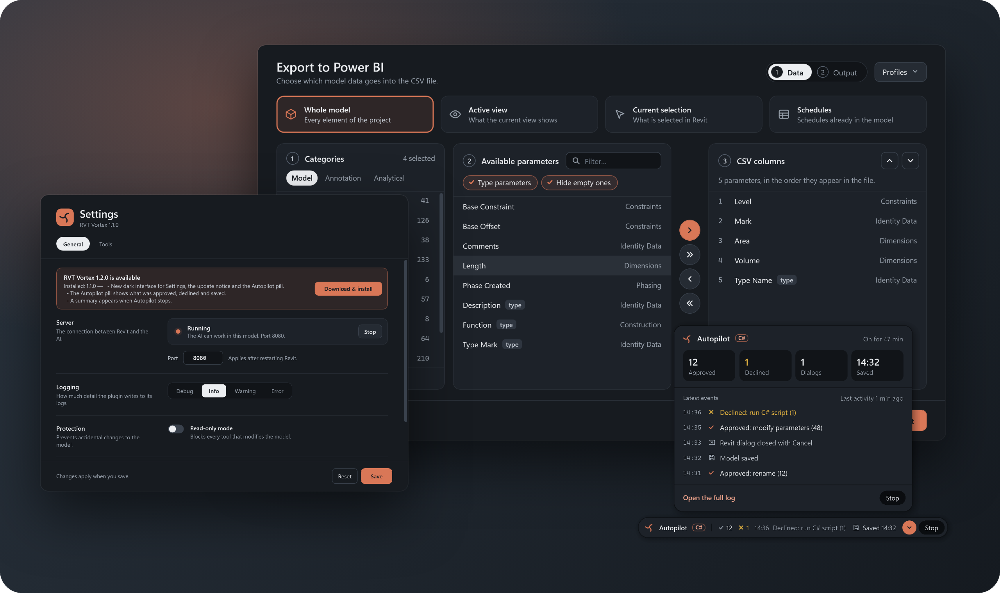<br>
  <sub>Power BI export, Settings and the Autopilot panel. Every window on this page is rendered from the code in this repository by its UI tests, not mocked up.</sub>
</p>

## What it is

**RVT Vortex** is a Revit add-in plus an [MCP](https://modelcontextprotocol.io) server. You write what you want in Claude (or any AI client that speaks MCP), and the AI does it in your open Revit model through **289 dedicated tools**: it can query, create, edit, audit and export, and it can look at a view as a picture to check its own work.

> *Check this model's health and list the five most common warnings.*
>
> *Number every door on Level 2 that has no Mark: D-201, D-202…*
>
> *Create a sheet for each floor plan and place its view on it.*
>
> *Run clash detection between structural framing and ducts, and open the clashes in a 3D view.*

It is a fork of [**RevitCortex**](https://github.com/LuDattilo/revitcortex) by Luigi Dattilo, built around one idea: **you should be able to hand the AI a long task and leave.** It is free, MIT-licensed, asks for no license key and sends no telemetry.

<details>
<summary><b>Contents</b></summary>

- [Why install it](#why-install-it)
- [RVT Vortex vs RevitCortex](#rvt-vortex-vs-revitcortex)
- [A tour of the interface](#a-tour-of-the-interface)
- [How Autopilot works](#how-autopilot-works)
- [Install in two minutes](#install-in-two-minutes)
- [What the AI can do](#what-the-ai-can-do)
- [Can I trust it?](#can-i-trust-it)
- [Compatibility and status](#compatibility-and-status)
- [Everything this fork changes](#everything-this-fork-changes)
- [FAQ](#faq)
- [Building from source](#building-from-source)
- [Contributing and support](#contributing-and-support)
- [Credits and license](#credits-and-license)

</details>

## Why install it

<table>
  <tr>
    <td width="33%" valign="top">
      <h4>🌀 Autopilot</h4>
      One toggle and no dialog can stall the session. Ordinary edits are approved, Revit's pop-ups are closed, and anything that needs a human is declined and noted, never approved.
    </td>
    <td width="33%" valign="top">
      <h4>💾 Nothing is lost</h4>
      The model is saved after changes, at most once a minute, with Revit's backup copies. A live pill, a summary and a readable log tell you what happened while you were away.
    </td>
    <td width="33%" valign="top">
      <h4>🎛️ An interface that looks the part</h4>
      One dark theme for Settings, the update notice, the Autopilot pill and the Power BI export, in English, Spanish or Italian, following Windows.
    </td>
  </tr>
  <tr>
    <td valign="top">
      <h4>🏗️ Loads in Revit 2027</h4>
      Revit 2027 ignores add-ins in <code>ProgramData</code> and ships an Autodesk add-in with the same ID the original used. RVT Vortex installs where 2027 looks and has its own ID.
    </td>
    <td valign="top">
      <h4>🔓 No license key, no telemetry</h4>
      No account, no activation, no Premium tier. Nothing about you or your models is sent to this project or to the original one.
    </td>
    <td valign="top">
      <h4>🧭 The AI knows the rules</h4>
      The usage guide (cheapest tool first, dry runs, limits, what to do when you are away) is sent to every MCP client on connect, not left in a file only coding agents read.
    </td>
  </tr>
</table>

## RVT Vortex vs RevitCortex

RevitCortex is the foundation: its author wrote the server, the plugin architecture and the 288 tools. This is what the fork changes on top of it.

| | RevitCortex | RVT Vortex |
|---|---|---|
| **Leaving the AI alone** | Every edit waits for a click. "Auto" can only be switched on from the first dialog, and covers neither scripts nor Revit's pop-ups | **Autopilot** toggle in the ribbon: no dialog can stall the session |
| **Revit's own pop-ups** | Wait for a click, freezing every queued call | Closed automatically, choosing Cancel / Close / No when possible |
| **Saving** | Manual | Auto-save when Revit is idle, at most once a minute, with Revit's backups |
| **Seeing the model** | The AI works from data alone, or from a screenshot of your screen | `get_view_image` sends the AI a picture of any view or sheet, zoomed on the elements it wants to check |
| **What happened while you were away** | Technical audit log | Live status pill, activity panel, a summary when it stops, and a readable `autopilot.log` |
| **Revit 2027** | The installer puts the add-in where Revit 2027 ignores it, and the add-in ID clashes with Autodesk's FormaOpenIn | Installs to the per-user folder Revit 2027 loads, with its own add-in ID |
| **Windows** | Light windows, each with its own hard-coded colors | One dark theme shared by every window |
| **Power BI export** | A light wizard with its text hard-coded in Italian | Two steps with scope cards, searchable parameters, a preview of the rows, and columns in the order you set, in three languages |
| **Installer and updates** | Plain script output | Spinning ASCII vortex, six checked steps, a progress bar and a summary; a failure stays on screen |
| **Language** | English / Italian | Follows the Windows language: English, Spanish or Italian |
| **Guidance for the AI** | Only in `CLAUDE.md`, which chat clients never see | Sent to every MCP client on connect, with stale rules fixed |
| **Bug reports** | E-mails your log to the author | Diagnostic ZIP with names, paths and model data removed, plus a pre-filled GitHub issue |
| **Telemetry** | Opt-in error reports to the author's service | None: the code is never started |
| **License** | MIT. Branded "RevitCortex Premium", with a License & Account window and license code (trial, expiry, lock to one machine) whose enforcement is not switched on in released builds | MIT. No license window, no Premium branding, and the license code is never started |

<sub>Compared with RevitCortex <code>main</code> in October 2026. The reasoning behind each change, with the files involved, is in <a href="FORK.md">FORK.md</a>.</sub>

## A tour of the interface

### The ribbon

<p align="center">
  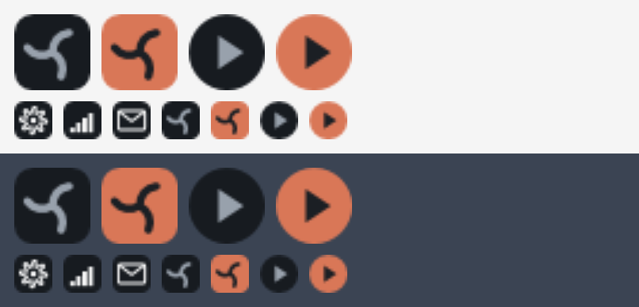
</p>

| Button | |
|---|---|
| **Vortex Switch** | Starts and stops the server the AI talks to. Dark = off, orange = on. |
| **Autopilot** | Lets the AI keep working without anyone clicking. Dark = off, orange = on. |
| Settings · Power BI Export · Report a bug | Configuration, the export window, and a diagnostic ZIP with a new GitHub issue. |

Every icon sits on a dark tile, so it reads the same on Revit's light and dark themes.

### Autopilot: the pill, the panel and the summary

<p align="center">
  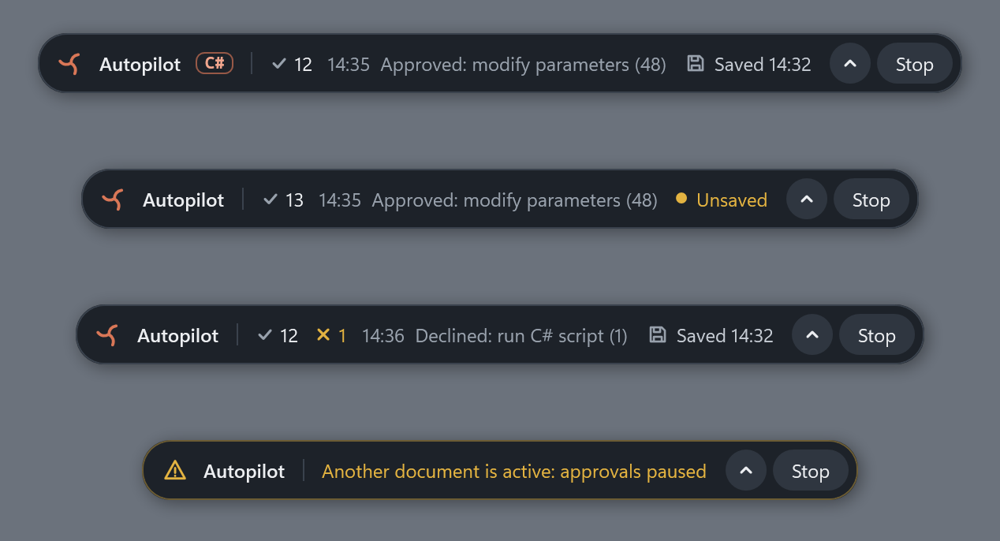
</p>

While Autopilot is on, a pill sits at the bottom of the screen. Its mark spins while the AI is calling tools. It counts what was approved and declined, shows the latest event and the last save, and turns amber when nothing can happen (another document is active, or the server is off).

<table>
  <tr>
    <td width="56%" valign="top">
      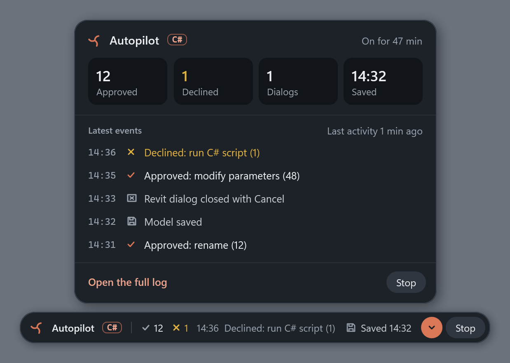<br>
      <sub>The arrow opens the activity panel: totals, the last five events and the full log.</sub>
    </td>
    <td width="44%" valign="top">
      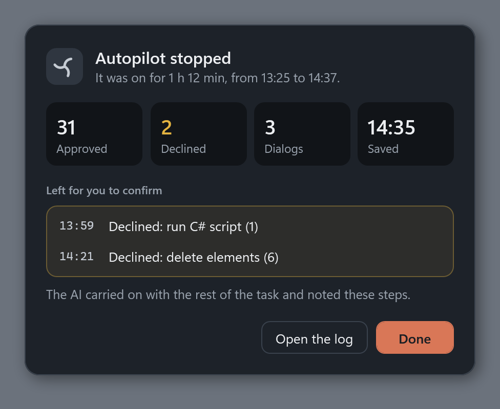<br>
      <sub>When Autopilot stops, a summary lists what it declined, so you know what is left for you.</sub>
    </td>
  </tr>
</table>

### Settings

<table>
  <tr>
    <td width="50%" valign="top">
      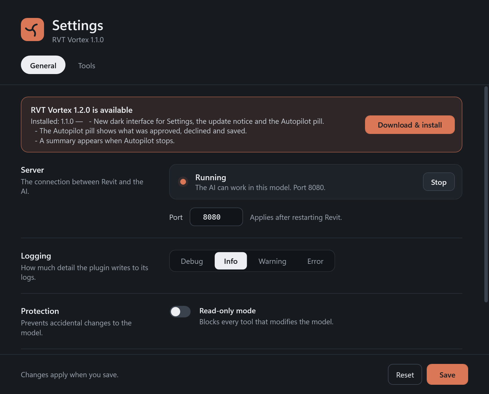<br>
      <sub><b>General.</b> Start and stop the server, the port, the log level, read-only mode, and updates in one click.</sub>
    </td>
    <td width="50%" valign="top">
      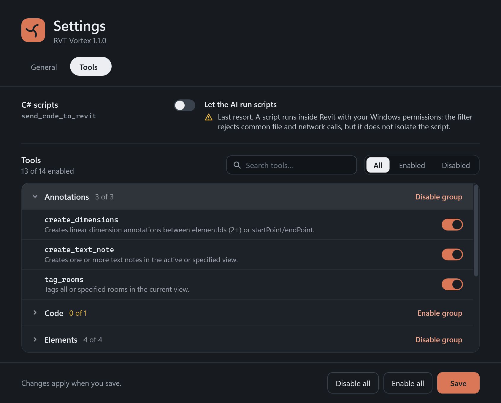<br>
      <sub><b>Tools.</b> Search the 289 tools, filter by enabled or disabled, and switch a whole category off. Scripts are off until you turn them on.</sub>
    </td>
  </tr>
</table>

### Power BI export

<p align="center">
  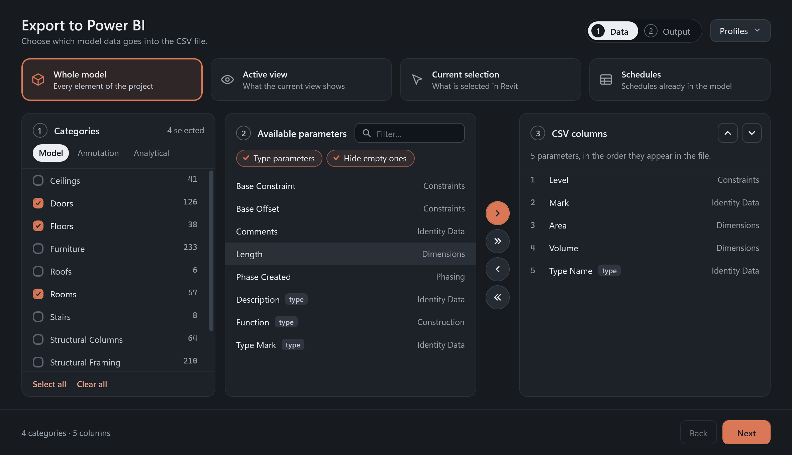<br>
  <sub><b>1 · Data.</b> Whole model, active view, current selection or the schedules you already have. Tick categories, then move parameters into the list of CSV columns and order them.</sub>
</p>

<p align="center">
  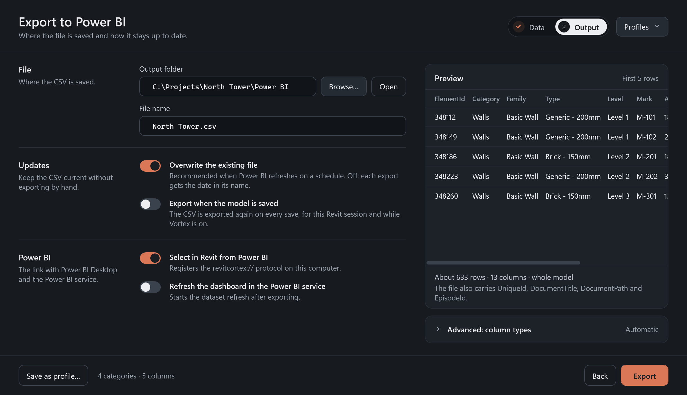<br>
  <sub><b>2 · Output.</b> Where the file goes, export again on every save, select in Revit from Power BI, and a preview of the first rows before you export.</sub>
</p>

<details>
<summary><b>Or export the schedules the model already has</b></summary>
<br>
<p align="center">
  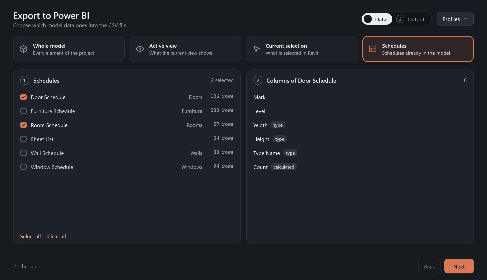<br>
  <sub>Each schedule becomes its own CSV, with the columns it already has.</sub>
</p>
</details>

Profiles keep a whole export (scope, categories, columns in order, destination) so the next one is two clicks.

### Installer and updates

<p align="center">
  <br>
  <sub><b><code>install.bat</code>.</b> Six steps with a check mark each, a progress bar while the server is copied, and a summary of what was installed and what to do next.</sub>
</p>

<details>
<summary><b>What an update looks like</b></summary>
<br>
<p align="center">
  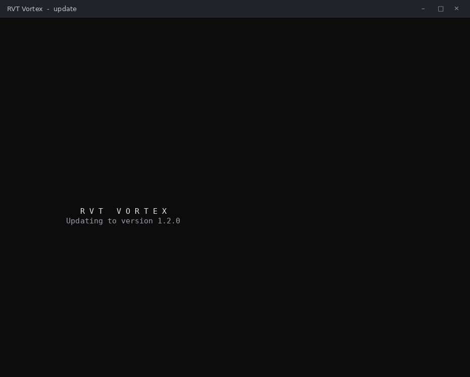<br>
  <sub>The vortex turns while Revit closes, nothing is asked, and the window closes by itself. If something fails, it stays open with the reason.</sub>
</p>
</details>

<sub>Both are recorded from the installer's demo mode (<code>distribution/tests/VortexUi.Demo.ps1</code>), which plays the real screens with sample data.</sub>

<p align="center">
  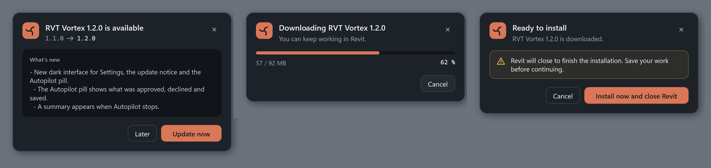<br>
  <sub>Inside Revit: what's new, the download while you keep working, and one button to install. The download is checked against the SHA-256 published with the release.</sub>
</p>

## How Autopilot works

Click **Autopilot** in the ribbon. It turns orange, and every point where the session used to stop now has an answer:

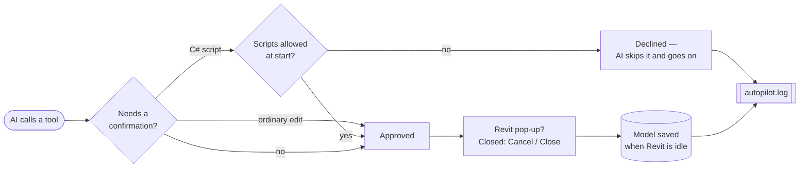

It **fails closed**: anything that would need a human decision is declined, never approved. The worst case is a step left pending, not an unwanted change. If you open another document, approvals pause, so a model you did not pick is never edited.

The [Autopilot guide](docs/AUTOPILOT.md) has the details, what to set in your AI client so it stops asking too, and a prompt that works well.

## Install in two minutes

**You need:** Windows 10 or 11, Revit 2023 to 2027 (not LT), and an AI client that supports MCP. The MCP server is self-contained, and the add-in runs on the .NET that Revit itself needs: if Revit starts, you have it.

### 1 · Download

Get [`RVT-Vortex-vX.Y.Z.zip`](https://github.com/lvxro/rvt-vortex/releases/latest) from the latest release. One ZIP covers Revit 2023, 2024, 2025, 2026 and 2027.

### 2 · Install

Close Revit, unzip, double-click **`install.bat`** and accept the Windows administrator prompt. It finds your Revit versions, installs the add-in and the MCP server, and offers to connect Claude Desktop or Claude Code for you.

Then open Revit: the **Add-Ins** tab has an **RVT Vortex** panel.

### 3 · Connect your AI client

If you let the installer do it, skip this step.

<details>
<summary><b>Claude Desktop</b></summary>

Edit `%APPDATA%\Claude\claude_desktop_config.json` and restart Claude Desktop:

```json
{
  "mcpServers": {
    "revitcortex": {
      "command": "C:\\Users\\<you>\\.revitcortex\\server\\RevitCortex.Server.exe"
    }
  }
}
```
</details>

<details>
<summary><b>Claude Code</b></summary>

```bash
claude mcp add revitcortex "C:\Users\<you>\.revitcortex\server\RevitCortex.Server.exe"
```
</details>

<details>
<summary><b>Codex, Cursor, Continue, Cline, Gemini CLI…</b></summary>

Any client with stdio MCP support works. Setup for each one is in the [full reference](docs/REVITCORTEX_README.md#mcp-client-setup--choose-your-client).
</details>

> [!NOTE]
> The internal names (the `revitcortex` entry, the `.revitcortex` folder) are kept on purpose, so an existing RevitCortex setup keeps working.

### 4 · Try it

In Revit, click **Vortex Switch** (it turns orange), then ask your AI client:

> *Check this model's health and list the five most common warnings.*

**Updating** takes two clicks from the notice inside Revit. **Uninstalling**: right-click `uninstall.ps1` in the unzipped folder and choose *Run with PowerShell*.

## What the AI can do

| Area | Tools | Examples |
|---|---:|---|
| Rebar | 64 | create, shape, splice, number and annotate reinforcement |
| Structural steel | 48 | connections, cuts, fabrication data |
| Elements & Power BI | 36 | query, filter, select, copy, measure; publish to Power BI |
| Project & workflows | 35 | health check, warnings, purge, clash detection, tags, levels, rooms, C# scripts (opt-in) |
| Views & sheets | 25 | views, templates, filters, sheets, viewports, schedules; a picture of any view |
| Creation & exchange | 22 | point, line and surface-based elements, floors, grids, dimensions; Excel and CSV import and export |
| IFC | 20 | export, link, rebuild IFC geometry as native elements |
| Links | 13 | load, move, pin and inspect linked models |
| Parameters | 11 | set, bulk edit, CSV sync, shared, global and project parameters |
| Materials | 9 | materials, compound structures, quantities |
| Meta | 6 | connection check, project info, cache, cross-app selection |

Every tool with its parameters: [`tool-schemas.txt`](tool-schemas.txt). Descriptions: [full reference](docs/REVITCORTEX_README.md#tool-reference).

## Can I trust it?

An add-in that lets an AI edit your model should earn that. This is what protects the model, and what the add-in does and does not do with your data.

**Your model**

- **Preview first.** Tools that change the model default to `dryRun: true`: they report what they would do before doing it.
- **Confirmations.** Destructive edits ask in Revit before running, unless you turned Autopilot on.
- **Read-only mode.** One setting blocks every tool that writes.
- **Audit log.** Every call is recorded in `%USERPROFILE%\.revitcortex\audit.jsonl`.
- **Scripts are opt-in and filtered.** `send_code_to_revit` is off until you enable it in Settings, and rejects scripts with common file, network, registry, process or reflection calls. That filter is a text check, not isolation: a script that passes runs inside Revit with your Windows account's permissions, so allow scripts only in a session you trust.

**Your data**

- **No telemetry.** The error-report code inherited from the original project is never started. Nothing is queued or sent.
- **No account and no license server.** Nothing to activate, nothing that can expire.
- **What goes online.** The add-in checks this repository for a new version, and calls Power BI only if you turn on the dataset refresh. Your AI client receives what the tools return, as with any MCP server: that part is between you and your AI provider.
- **Bug reports are redacted.** "Report a bug" builds a ZIP without your user name, machine name, model names, paths, tool inputs or the Revit journal, and the public issue carries only version numbers.

**The code**

- **Open source, MIT.** Every line is in this repository.
- **Built in public.** Each release ZIP is built by [GitHub Actions](https://github.com/lvxro/rvt-vortex/actions) from a tagged commit, for all five Revit versions. If one fails to build, or a test fails, nothing is published.
- **Checked updates.** The in-app update is verified against the SHA-256 published in [`latest.json`](latest.json).
- **Tested on every change.** CI runs the unit tests, builds every window without Revit, and installs, updates and uninstalls the package on a Windows runner.

## Compatibility and status

| Revit | Framework | Built and unit-tested in CI | Tried inside Revit |
|---|---|:---:|:---:|
| 2027 | .NET 10 | ✅ | ✅ |
| 2026 | .NET 8 | ✅ | not yet |
| 2025 | .NET 8 | ✅ | not yet |
| 2024 | .NET Framework 4.8 | ✅ | not yet |
| 2023 | .NET Framework 4.8 | ✅ | not yet |

The fork is developed on Revit 2027. The other versions build from the same code and the original project supports them, but nobody has reported a run of this fork on them yet. If you try one, [tell us how it went](https://github.com/lvxro/rvt-vortex/issues/new).

## Everything this fork changes

The short version is the [comparison table](#rvt-vortex-vs-revitcortex). This is the long one. Per release: [CHANGELOG.md](CHANGELOG.md). With the reasoning and the files: [FORK.md](FORK.md).

<details>
<summary><b>Autopilot</b> — leave the AI working</summary>

- **Autopilot** toggle in the ribbon. One confirmation to turn it on.
- Ordinary confirmations (delete, rename, edit parameters…) are approved automatically.
- C# scripts are declined without opening a dialog, unless you ticked "Also allow C# scripts" when starting.
- Revit's own pop-ups are closed, preferring Close / Cancel / No; OK only when there is no other choice. The add-in's own dialogs are never auto-closed.
- Switching document pauses approvals; closing the document turns Autopilot off.
- Auto-save when Revit is idle, at most once a minute. It skips read-only and never-saved documents and never syncs with central.
- When a step is declined, the AI is told the user is away: skip it, keep going, and list it as pending. Before, it was told to ask you and wait.
- Everything decided without you is written to `autopilot.log`, in your language.
</details>

<details>
<summary><b>Tools</b> — the AI can see the model</summary>

- **`get_view_image`** (new, tool 289). Exports a view or a sheet and returns it to the AI as a picture, so it can check what it built without a screenshot of your screen. With no arguments it captures the whole active view; `viewId` or `viewName` capture any other view or sheet, open or not; `elementIds` zooms the active view to those elements, captures them and puts your zoom back; `region: "visible"` captures what you are looking at. Read-only: it works in read-only mode and under Autopilot.
- Pictures are kept under 700 kB so every client accepts them: a larger one is retried as JPEG, then smaller, and the result says so.
- **`get_selected_elements`** now returns family, type and level for each element (before: only ID, name and category), reports how many are selected when the list is cut, and its `limit` can finally be set (the server never declared it).
</details>

<details>
<summary><b>Interface</b> — one dark theme, redesigned windows</summary>

- **Theme.** One palette and one set of controls for every window (`UI/Theme.xaml`). Orange means on or the main action, a light pill marks the selected option, amber means something needs attention.
- **Ribbon.** Two large toggles (Vortex Switch, Autopilot) on a dark tile when off and orange when on, with labels that change (*Vortex ON*, *Autopilot ON*). Settings, Power BI Export and Report a bug are stacked next to them. The Vortex mark is the product's own icon.
- **Autopilot pill.** A compact pill at the bottom of the screen: the mark spins while the AI works; approved and declined counts, the latest event, the last save, and amber warnings. Drag it anywhere.
- **Activity panel.** Totals, the last five events and a link to the full log.
- **Autopilot summary.** When Autopilot stops: how long it ran, the totals and the steps it declined.
- **Settings.** Two tabs. *General*: each setting is a row with its explanation; the server can be started and stopped from here. *Tools*: a search box, an enabled / disabled filter and a switch per category.
- **Update notice.** What's new, download progress while you keep working, ready to install, and a retry when the download fails.
- **Power BI export.** Rebuilt in two steps:
  - *Data*: four scope cards (whole model, active view, current selection, existing schedules), categories in tabs with counts, parameters with a filter and "type parameters" / "hide empty ones" chips, and the list of CSV columns with move up / down.
  - *Output*: folder and file name, overwrite, export on save, the link with Power BI, a preview of the first rows, and the column types (collapsed).
  - Profiles are in a menu at the top right, and loading one restores its columns in order.
  - The CSV columns come out in the order of your list, instance parameters first and type parameters after them. Before, the order was whatever Revit enumerated.
  - Categories hidden by the chosen scope are no longer exported, and the footer says what is chosen or, in amber, what is missing.
- **Installer.** `install.bat` opens on a spinning ASCII vortex, lists six steps with a check mark each, shows a progress bar while the server is copied, and ends with a summary and what to do next. During an update the vortex turns while Revit closes and the window closes by itself. A failure stays on screen instead of closing with the error in it. The uninstaller looks the same.
- **Languages.** The interface follows the Windows display language first (then Revit's). Spanish was added to every existing text; all the new windows, the installer and the log come in English, Spanish and Italian.
</details>

<details>
<summary><b>Revit 2027</b> — the add-in loads</summary>

- Revit 2027 no longer loads add-ins from `C:\ProgramData\Autodesk\Revit\Addins\2027`. The installers put the add-in there and then deleted the per-user copy, leaving no valid one. For Revit 2027 and later they now install to the per-user folder.
- The original add-in ID was a placeholder that Autodesk's FormaOpenIn add-in, shipped with Revit 2027, also uses. Revit refused one of the two and the ribbon buttons answered "plugin not initialized". RVT Vortex has its own ID.
- The installers remove a stale manifest from the 2027 all-users folder, or tell you when they need administrator rights to do it.
- When the plugin fails to start, the buttons show the real error instead of "not initialized".
</details>

<details>
<summary><b>Guidance for the AI</b> — rules that reach every client</summary>

- The usage rules (language detection, which tool to pick, token limits, dry runs, cancellations, Autopilot, scripts) are now in the MCP server instructions that every client receives. They lived in `CLAUDE.md`, which Claude Desktop never reads.
- `ai_element_filter` and `operate_element`: the guides required a `data` wrapper the server already adds, so following them produced failing calls.
- Range and AND/OR parameter filters now point to `filter_by_parameter_value`; they pointed to a tool that does not filter on parameter values.
- Stale defaults corrected (`get_warnings`, `get_project_info`), and `say_hello` documented as the cheap way to detect the model's language.
- The most used and most expensive tools carry their usage hints in their own descriptions.
- `set_element_parameters` gained a dry run, and models in Spanish and Portuguese are detected.
</details>

<details>
<summary><b>Privacy and licensing</b> — nothing leaves, nothing to activate</summary>

- **Telemetry off.** The error-report sender inherited from the original project posts to its author's service. The fork never starts it, never asks for consent on first run, and hides the toggle.
- **Bug reports.** "Send log to support" e-mailed your log to the original author. It is now "Report a bug": a diagnostic ZIP redacted by default plus a pre-filled issue in this repository.
- **License.** The original labels itself "RevitCortex Premium" and carries the code for a paid license: trial, expiry, a lock to one machine, and a gate that would put the editing tools in read-only mode. In its released builds that gate is not switched on yet, so it does not block anything today. The fork removes the Premium branding and the License & Account button and never starts that code.
- **Updates and reports point here.** The original update checker offered to install the original build over the fork with one click. It now reads this repository's releases.
- **Script filter described as what it is.** The docs and the Settings window no longer call the C# script filter a sandbox.
</details>

<details>
<summary><b>Engineering</b> — how it stays working</summary>

- **CI on every push and pull request:** unit tests and a full package build for all five Revit versions.
- **UI preview tests:** every window is built without Revit, in each state a user can meet. A missing resource or a broken template fails the tests, and the pictures are published for review. The screenshots on this page come from there.
- **Installer tests:** the scripts are checked under Windows PowerShell 5.1, and CI installs, updates and uninstalls the built package on the runner.
- **Releases:** pushing a `vX.Y.Z` tag builds every Revit version, attaches the ZIP and rewrites `latest.json` with its SHA-256. If a version fails to build, nothing is published.
- **The installer stops a running MCP server** before replacing its files, so an update no longer fails on locked files.
</details>

## FAQ

<details>
<summary><b>Is it really free?</b></summary>

Yes. MIT license, no key, no trial, no paid tier. You pay only for your AI client, if it is a paid one.
</details>

<details>
<summary><b>Does it send my model anywhere?</b></summary>

The add-in does not. Your AI client receives what the tools return (element data, parameter values, counts), because that is how it works on the model. What happens to it then depends on your AI provider.
</details>

<details>
<summary><b>Can the AI wreck my model?</b></summary>

It can change it, which is the point, so the defaults are careful: previews before writes, confirmations for destructive edits, a read-only mode, and with Autopilot automatic saves that leave Revit's backup copies. For a long unattended task, work on a copy or a detached model the first time.
</details>

<details>
<summary><b>I already use RevitCortex. Can I switch?</b></summary>

Yes. Install RVT Vortex over it: the folder, the MCP server entry and the tool names are unchanged, so your client configuration keeps working.
</details>

<details>
<summary><b>Which AI clients work?</b></summary>

Any client with stdio MCP support: Claude Desktop, Claude Code, Codex, Cursor, Continue, Cline, Gemini CLI and others. The installer sets up the two Claude clients for you.
</details>

<details>
<summary><b>Why is the folder still called <code>.revitcortex</code>?</b></summary>

On purpose. Renaming the folder, the server entry or the tools would break every existing setup for no gain. Everything you see says RVT Vortex.
</details>

## Building from source

Clone the repository, close Revit and run **`INSTALL.bat`**. It checks for the .NET SDK, backs up your current install and builds with `deploy.ps1`. The build commands for each Revit version are in [`CLAUDE.md`](CLAUDE.md#build-commands).

Releases are automated: pushing a `vX.Y.Z` tag builds every Revit version and attaches the ZIP. See [FORK.md](FORK.md#releasing-a-new-version).

## Contributing and support

- **Found a bug?** Use **Report a bug** in the ribbon, or [open an issue](https://github.com/lvxro/rvt-vortex/issues/new).
- **Tried it on Revit 2023 to 2026?** A one-line issue saying it works (or how it fails) is the most useful contribution right now.
- **Pull requests are welcome.** CI builds every Revit version and runs the tests on each one. If you touch a window, add its state to the UI preview tests.

## Credits and license

RVT Vortex stands on [RevitCortex](https://github.com/LuDattilo/revitcortex) by **Luigi Dattilo**: the server, the 288 tools and the plugin architecture are his work. This fork adds Autopilot, the Revit 2027 fix, the interface, the installer and the updated AI guidance.

Released under the [MIT license](LICENSE), like the original. Autodesk and Revit are trademarks of Autodesk, Inc.; this project is not affiliated with Autodesk.

<p align="center"><sub>If RVT Vortex saves you an afternoon, a ⭐ helps other Revit users find it.</sub></p>
